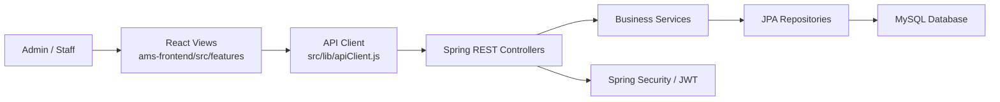
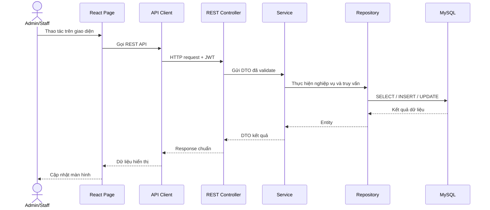
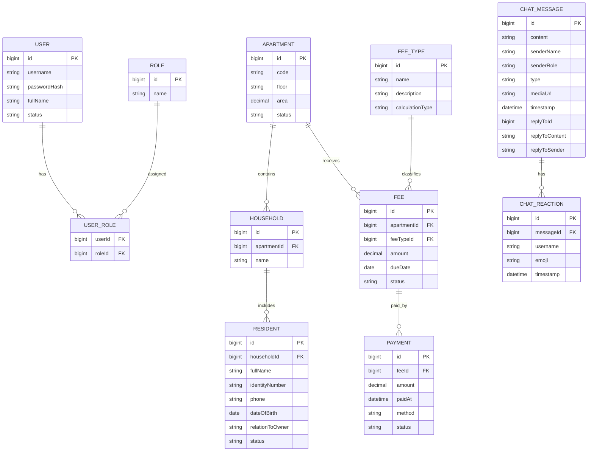

# Thiết kế hệ thống

Tài liệu này mô tả thiết kế kiến trúc cho BlueMoon AMS dựa trên mã nguồn hiện tại trong repo. Nội dung mục `7.3` được trình bày theo hướng dẫn của tuần 10: chuyển các lớp phân tích/use case thành các thành phần thiết kế, tổ chức thành package, xác định kiến trúc và mô tả quan hệ giữa các thành phần.

## 7.3 Thiết kế kiến trúc phần mềm

### Mục tiêu kiến trúc

BlueMoon AMS là hệ thống quản lý chung cư, tập trung vào các nghiệp vụ quản lý cư dân, căn hộ, khoản thu và thanh toán. Kiến trúc được thiết kế để:

- Tách rõ giao diện, xử lý nghiệp vụ và lưu trữ dữ liệu.
- Dễ mở rộng theo từng module nghiệp vụ như `resident`, `apartment`, `fee`, `payment`, `auth`, `chat`, `announcement`, `notification`, `report`, `vehicle`.
- Dễ kiểm thử vì mỗi tầng có trách nhiệm riêng.
- Phù hợp với repo hiện tại gồm `ams-frontend`, `ams-backend`, `database`, `deployment` và `docs`.

### Kiểu kiến trúc được chọn

Hệ thống sử dụng kiến trúc client-server kết hợp mô hình MVC theo tầng:

- **View**: ứng dụng React/Vite trong `ams-frontend`, gồm các trang và component hiển thị dữ liệu cho người dùng.
- **Controller**: các REST controller trong Spring Boot backend, tiếp nhận HTTP request và trả HTTP response.
- **Model**: entity, DTO, mapper, repository và service trong backend; dữ liệu được lưu trong MySQL.
- **Service layer**: tầng xử lý nghiệp vụ nằm giữa controller và repository.
- **Repository layer**: tầng truy cập dữ liệu sử dụng Spring Data JPA.



### Phân rã package theo MVC

| Nhóm thiết kế | Vị trí trong repo | Trách nhiệm |
|---|---|---|
| `views` | `ams-frontend/src/features/*/pages`, `components` | Hiển thị màn hình, nhận thao tác người dùng, gọi API |
| `api client` | `ams-frontend/src/features/*/api`, `src/lib/apiClient.js` | Chuẩn hóa cách gọi REST API, gắn token xác thực |
| `controllers` | `ams-backend/src/main/java/com/bluemoon/ams/module/*/controller` | Nhận request, validate input, gọi service |
| `services` | `ams-backend/src/main/java/com/bluemoon/ams/module/*/service` | Xử lý nghiệp vụ chính của use case |
| `models/entities` | `ams-backend/src/main/java/com/bluemoon/ams/module/*/entity` | Biểu diễn dữ liệu nghiệp vụ ánh xạ xuống database |
| `dto` | `ams-backend/src/main/java/com/bluemoon/ams/module/*/dto` | Dữ liệu vào/ra của API, tránh lộ trực tiếp entity |
| `mappers` | `ams-backend/src/main/java/com/bluemoon/ams/module/*/mapper` | Chuyển đổi giữa entity và DTO |
| `repositories` | `ams-backend/src/main/java/com/bluemoon/ams/module/*/repository` | Truy vấn và ghi dữ liệu qua JPA |
| `common` | `ams-backend/src/main/java/com/bluemoon/ams/common` | Cấu hình, bảo mật, response chuẩn, exception chung |

### Thiết kế module nghiệp vụ

| Module | View/API frontend | Controller backend | Service backend | Model dữ liệu chính |
|---|---|---|---|---|
| Xác thực | `features/auth` | `module/auth/controller` | `module/auth/service` | `User`, `Role`, `UserRole` |
| Căn hộ | `features/apartments` | `module/apartment/controller` | `module/apartment/service` | `Apartment` |
| Cư dân | `features/residents` | `module/resident/controller` | `module/resident/service` | `Resident`, `Household` |
| Khoản thu | `features/fees` | `module/fee/controller` | `module/fee/service` | `Fee`, `FeeType` |
| Thanh toán | `features/payments` | `module/payment/controller` | `module/payment/service` | `Payment` |
| Chat | `features/chat` | `module/chat/controller` | `module/chat/service` | `ChatMessage`, `ChatReaction` |
| Thông báo | `features/announcements` | `module/announcement/controller` | `module/announcement/service` | `Announcement` |
| Phương tiện | `features/vehicles` | `module/vehicle/controller` | `module/vehicle/service` | `Vehicle` |
| Phản ánh | `features/reports` | `module/report/controller` | `module/report/service` | `Report` |
| Hồ sơ cư dân | `features/profile` | `module/resident/controller` | `module/resident/service` | `Resident` |

### Luồng xử lý use case

Luồng chung cho các use case quản lý dữ liệu như xem danh sách cư dân, thêm căn hộ, tạo khoản thu hoặc ghi nhận thanh toán:



### Kiến trúc backend

Backend là ứng dụng Spring Boot trong `ams-backend`, sử dụng Java 17, Spring Web, Spring Security, Spring Data JPA, Bean Validation, JWT, Lombok và MapStruct.

Quy ước tổ chức trong mỗi module:

```text
module/<domain>/
  controller/   REST API endpoint
  dto/          request/response object
  entity/       JPA entity
  mapper/       entity <-> dto mapper
  repository/   Spring Data JPA repository
  service/      business logic
```

Nguyên tắc thiết kế backend:

- Controller không xử lý nghiệp vụ phức tạp; chỉ nhận request, validate và gọi service.
- Service là nơi đặt luật nghiệp vụ như tính khoản thu, kiểm tra trạng thái thanh toán, kiểm tra dữ liệu cư dân/căn hộ.
- Repository chỉ phụ trách truy cập dữ liệu.
- DTO được dùng ở biên API để tránh trả trực tiếp entity.
- `common.exception` và `common.response` chuẩn hóa lỗi và response.
- `common.security` xử lý xác thực JWT và phân quyền.

### Kiến trúc frontend

Frontend là ứng dụng React/Vite trong `ams-frontend`, sử dụng React Router để điều hướng và tổ chức theo feature.

```text
src/
  App.jsx
  lib/apiClient.js
  features/
    auth/
    dashboard/
    residents/
    apartments/
    fees/
    payments/
    chat/                # ChatWidget, useChat hook
    announcements/       # Thông báo và sự kiện
    vehicles/            # Quản lý phương tiện
    profile/             # Trang cá nhân cư dân
    reports/             # Phản ánh cư dân
```

Nguyên tắc thiết kế frontend:

- Mỗi feature chứa `pages`, `components` và `api` riêng.
- `App.jsx` định nghĩa layout chính, sidebar và route. Tích hợp `ChatWidget` hiển thị trên tất cả trang.
- `apiClient.js` quản lý base URL, token và cách gửi request.
- Các trang chỉ điều phối trạng thái giao diện và gọi API; không chứa nghiệp vụ backend.
- Hệ thống có hai bộ route: một cho Admin/Staff và một cho Resident, điều hướng tự động theo role.
- Module `chat` sử dụng WebSocket (SockJS + STOMP) để gửi/nhận tin nhắn real-time.
- Module `profile` cho phép cư dân xem thông tin cá nhân và upload ảnh CCCD khi xin vào căn hộ.

### Thiết kế dữ liệu mức kiến trúc



### API contract dự kiến

| Nhóm | Method | Endpoint | Mục đích |
|---|---|---|---|
| Health | GET | `/api/v1/health` | Kiểm tra backend đang chạy |
| Auth | POST | `/api/v1/auth/login` | Đăng nhập và nhận JWT |
| Auth | GET | `/api/v1/auth/me` | Lấy thông tin người dùng hiện tại |
| Auth | GET | `/api/v1/auth/users/usernames` | Lấy danh sách username (cho chức năng mention) |
| Apartments | GET | `/api/v1/apartments` | Lấy danh sách căn hộ |
| Apartments | POST | `/api/v1/apartments` | Tạo căn hộ |
| Apartments | GET | `/api/v1/apartments/{id}` | Xem chi tiết căn hộ |
| Apartments | PUT | `/api/v1/apartments/{id}` | Cập nhật căn hộ |
| Apartments | DELETE | `/api/v1/apartments/{id}` | Xóa hoặc vô hiệu hóa căn hộ |
| Residents | GET | `/api/v1/residents` | Lấy danh sách cư dân |
| Residents | POST | `/api/v1/residents` | Tạo cư dân |
| Residents | GET | `/api/v1/residents/{id}` | Xem chi tiết cư dân |
| Residents | PUT | `/api/v1/residents/{id}` | Cập nhật cư dân |
| Residents | DELETE | `/api/v1/residents/{id}` | Xóa hoặc vô hiệu hóa cư dân |
| Residents | POST | `/api/v1/resident-self/request-join` | Cư dân xin vào căn hộ (kèm upload CCCD) |
| Fees | GET | `/api/v1/fees` | Lấy danh sách khoản thu |
| Fees | POST | `/api/v1/fees` | Tạo khoản thu |
| Payments | GET | `/api/v1/payments` | Lấy danh sách thanh toán |
| Payments | POST | `/api/v1/payments` | Ghi nhận thanh toán |
| Chat | GET | `/api/v1/chat/history` | Lấy lịch sử tin nhắn |
| Chat | POST | `/api/v1/chat/send` | Gửi tin nhắn |
| Chat | POST | `/api/v1/chat/react` | Thêm emoji reaction |
| Chat | POST | `/api/v1/chat/media/upload` | Upload file/ảnh trong chat |

### Quy ước response

Response thành công:

```json
{
  "success": true,
  "message": "OK",
  "data": {}
}
```

Response lỗi:

```json
{
  "success": false,
  "message": "Validation failed",
  "errors": [
    {
      "field": "code",
      "message": "Mã căn hộ không được để trống"
    }
  ]
}
```

### Bảo mật và phân quyền

- Người dùng đăng nhập qua module `auth` và nhận JWT.
- Frontend lưu token và gửi trong header `Authorization: Bearer <token>`.
- Spring Security kiểm tra token trước khi cho phép truy cập API quản trị.
- Mật khẩu chỉ lưu dưới dạng hash.
- Không trả dữ liệu nhạy cảm như `passwordHash` trong response.
- Các nghiệp vụ tài chính như tạo khoản thu và ghi nhận thanh toán cần lưu thời điểm tạo/cập nhật để phục vụ đối soát.

### Lý do chọn kiến trúc

Kiến trúc MVC/client-server phù hợp với BlueMoon AMS vì hệ thống hiện tại là ứng dụng web nội bộ, có giao diện React tách khỏi backend Spring Boot và database MySQL. Cách chia module theo domain giúp nhóm phát triển có thể làm độc lập từng nghiệp vụ, đồng thời vẫn giữ được cấu trúc nhất quán giữa frontend và backend.
