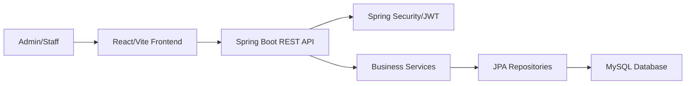
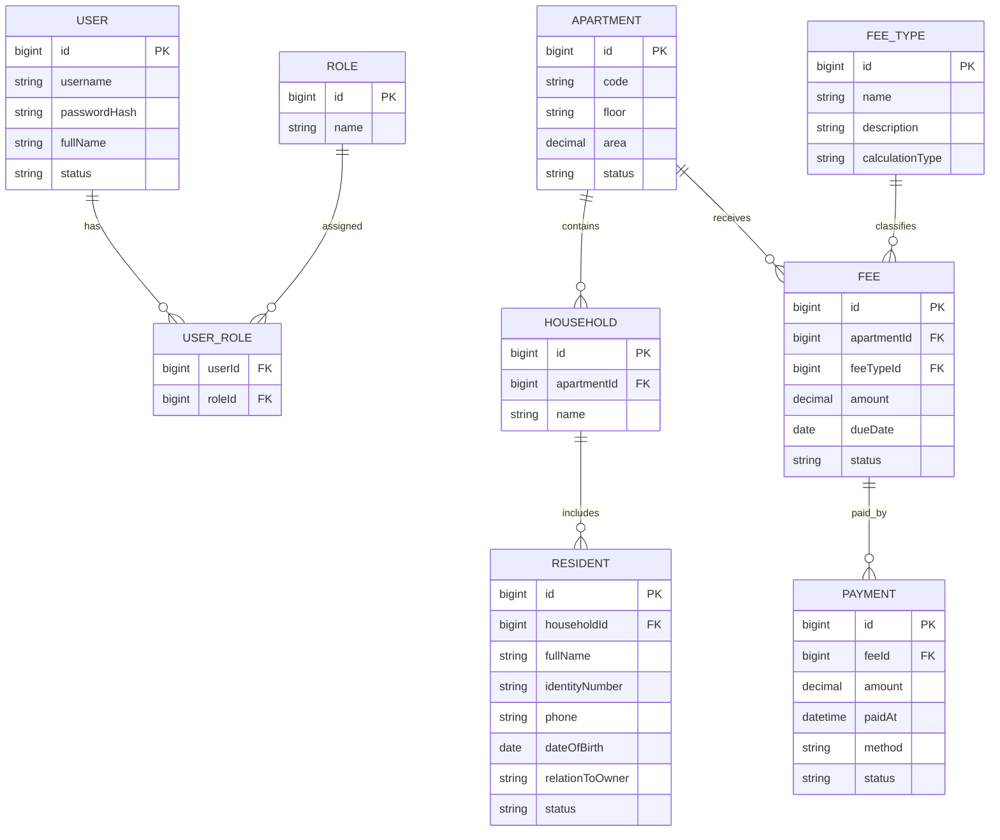

# Thiết kế hệ thống

## Kiến trúc tổng quan

BlueMoon AMS được tổ chức theo mô hình monorepo:

- `ams-frontend`: ứng dụng React/Vite, chịu trách nhiệm giao diện và gọi API.
- `ams-backend`: ứng dụng Spring Boot, cung cấp REST API, xác thực và xử lý nghiệp vụ.
- `MySQL`: lưu trữ dữ liệu căn hộ, cư dân, khoản thu và thanh toán.



## Module backend

| Module | Trách nhiệm |
|---|---|
| `common.config` | Cấu hình chung, CORS, security, mapper |
| `common.exception` | Xử lý lỗi tập trung |
| `common.response` | Chuẩn hóa response API |
| `module.auth` | Đăng nhập, user, role, JWT |
| `module.apartment` | Quản lý căn hộ |
| `module.resident` | Quản lý cư dân, hộ gia đình |
| `module.fee` | Loại phí, đợt thu, khoản thu |
| `module.payment` | Ghi nhận thanh toán, trạng thái giao dịch |

## Cấu trúc dữ liệu dự kiến



## API contract dự kiến

| Nhóm | Method | Endpoint | Mục đích |
|---|---|---|---|
| Health | GET | `/api/v1/health` | Kiểm tra backend đang chạy |
| Auth | POST | `/api/v1/auth/login` | Đăng nhập và nhận JWT |
| Auth | GET | `/api/v1/auth/me` | Lấy thông tin người dùng hiện tại |
| Apartments | GET | `/api/v1/apartments` | Lấy danh sách căn hộ |
| Apartments | POST | `/api/v1/apartments` | Tạo căn hộ |
| Apartments | GET | `/api/v1/apartments/{id}` | Xem chi tiết căn hộ |
| Apartments | PUT | `/api/v1/apartments/{id}` | Cập nhật căn hộ |
| Apartments | DELETE | `/api/v1/apartments/{id}` | Xóa hoặc vô hiệu hóa căn hộ |
| Residents | GET | `/api/v1/residents` | Lấy danh sách cư dân |
| Residents | POST | `/api/v1/residents` | Tạo cư dân |
| Residents | GET | `/api/v1/residents/{id}` | Xem chi tiết cư dân |
| Residents | PUT | `/api/v1/residents/{id}` | Cập nhật cư dân |
| Residents | DELETE | `/api/v1/residents/{id}` | Xóa hoặc vô hiệu hóa cư dân |
| Fees | GET | `/api/v1/fees` | Lấy danh sách khoản thu |
| Fees | POST | `/api/v1/fees` | Tạo khoản thu |
| Payments | GET | `/api/v1/payments` | Lấy danh sách thanh toán |
| Payments | POST | `/api/v1/payments` | Ghi nhận thanh toán |

## Quy ước response

Response thành công:

```json
{
  "success": true,
  "message": "OK",
  "data": {}
}
```

Response lỗi:

```json
{
  "success": false,
  "message": "Validation failed",
  "errors": [
    {
      "field": "code",
      "message": "Mã căn hộ không được để trống"
    }
  ]
}
```

## Nguyên tắc bảo mật

- Mật khẩu lưu bằng hash, không lưu plain text.
- API quản trị yêu cầu header `Authorization: Bearer <token>`.
- Token hết hạn cần trả lỗi rõ ràng để frontend điều hướng về đăng nhập.
- Không trả dữ liệu nhạy cảm như password hash trong response.
- Các thao tác tài chính cần ghi nhận thời điểm tạo/cập nhật.
