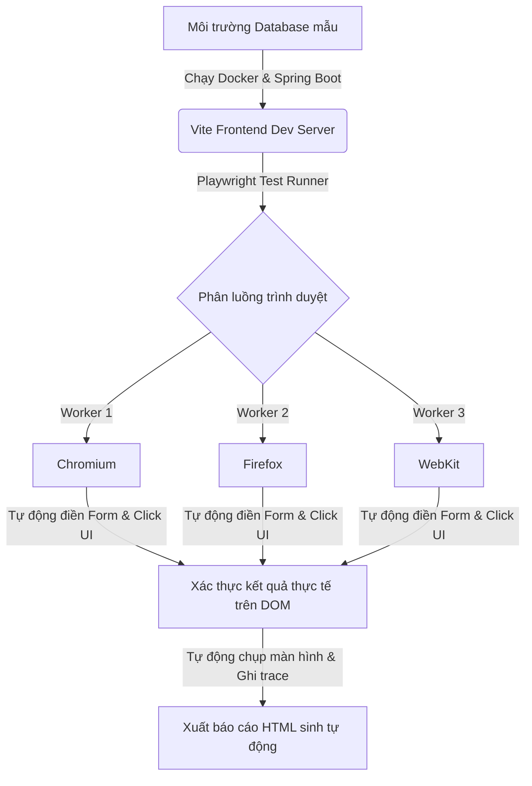

# BÁO CÁO KIỂM THỬ PHẦN MỀM (SOFTWARE TESTING REPORT)
## HỆ THỐNG QUẢN LÝ CĂN HỘ CHUNG CƯ (BLUEMOON AMS)
**Môn học:** Nhập môn Công nghệ Phần mềm / Kiểm thử Phần mềm  
**Môi trường áp dụng:** Hệ thống Quản lý Căn hộ BlueMoon AMS  
**Vai trò thực hiện:** Đội ngũ Đảm bảo Chất lượng (QA Team)  

---

## 1. Mục tiêu kiểm thử (Testing Objectives)
Mục tiêu chính của quá trình kiểm thử phần mềm đối với hệ thống BlueMoon AMS bao gồm:
*   **Xác minh tính đúng đắn (Verification):** Đảm bảo hệ thống hoạt động đúng theo các đặc tả yêu cầu chức năng (Functional Specifications) đã đề ra cho cả 3 vai trò: Admin (Quản trị viên), Staff (Nhân viên) và Resident (Cư dân).
*   **Xác nhận độ tin cậy (Validation):** Đảm bảo hệ thống đáp ứng đúng nhu cầu sử dụng thực tế của ban quản lý chung cư và cư dân.
*   **Đánh giá bảo mật và phân quyền (Security & RBAC):** Đảm bảo chính sách phân quyền vai trò (Role-Based Access Control) hoạt động chặt chẽ, ngăn chặn các hành vi leo thang đặc quyền (Privilege Escalation) từ người dùng có quyền thấp hơn (Staff, Resident) vào các chức năng quản trị cấp cao.
*   **Kiểm thử độ ổn định và trải nghiệm (Stability & UX):** Xác định tốc độ phản hồi của hệ thống, kiểm tra tính nhất quán về mặt giao diện và phát hiện các lỗi tiềm ẩn (race condition, database lock) khi có nhiều tác vụ thực hiện song song.

---

## 2. Phạm vi kiểm thử (Testing Scope)
Báo cáo này tập trung vào kiểm thử tích hợp (Integration Testing) và kiểm thử đầu cuối (End-to-End (E2E) Testing) toàn bộ luồng nghiệp vụ trên giao diện Web (UI/UX) kết nối trực tiếp với cơ sở dữ liệu MySQL thông qua API Spring Boot.

### Các thành phần nằm trong phạm vi kiểm thử (In-Scope):
*   Luồng đăng nhập/đăng xuất (Authentication) sử dụng tài khoản hệ thống thông thường và xác thực JWT.
*   Các mô-đun nghiệp vụ cốt lõi: Quản lý căn hộ, quản lý cư dân, quản lý khoản thu, xác nhận thanh toán (thủ công & qua QR), quản lý bảng tin và tiếp nhận phản ánh/complaints của cư dân.
*   Kiểm tra tính hợp lệ của dữ liệu đầu vào (Validation) trên cả Client-side và Server-side.
*   Kiểm thử chính sách phân quyền truy cập URL và hiển thị phần tử UI theo vai trò.

### Các thành phần nằm ngoài phạm vi kiểm thử (Out-of-Scope):
*   Kiểm thử hiệu năng tải cực hạn (Load Testing / Stress Testing) với hàng triệu người dùng đồng thời.
*   Kiểm thử bảo mật cấp độ mạng (Network Penetration Testing) hoặc tấn công DDoS.
*   Xác thực thực tế của bên thứ ba (Google OAuth thực tế ngoài môi trường Sandbox).

---

## 3. Các chức năng được kiểm thử (Tested Features)
Hệ thống BlueMoon AMS được kiểm thử thông qua 9 mô-đun chức năng chính:

| STT | Tên mô-đun | Các luồng kiểm thử chính |
| :--- | :--- | :--- |
| 1 | **Authentication** | Đăng nhập thành công Admin/Staff/Resident, xử lý khi nhập sai mật khẩu/tài khoản, kiểm soát trạng thái token JWT. |
| 2 | **Apartment Management** | Thêm mới căn hộ, ngăn chặn trùng số phòng, chỉnh sửa thông tin căn hộ, thay đổi trạng thái căn hộ. |
| 3 | **Resident Management** | Thêm cư dân mới vào hộ gia đình, kiểm tra định dạng CCCD/Số điện thoại, gán cư dân vào căn hộ trống. |
| 4 | **Fee / Invoice Management** | Tạo hóa đơn/khoản thu mới cho từng căn hộ hoặc tất cả căn hộ, thiết lập hạn thanh toán. |
| 5 | **Payment Confirmation** | Ghi nhận thanh toán thủ công bằng tiền mặt từ nhân viên, xác nhận thanh toán qua chuyển khoản QR code. |
| 6 | **Maintenance Requests** | Cư dân gửi phản ánh chất lượng dịch vụ (hỏng điện, nước), Admin/Staff tiếp nhận và cập nhật trạng thái xử lý. |
| 7 | **Notification Board** | Đăng bảng tin thông báo chung hoặc lịch sinh hoạt cộng đồng, hiển thị bảng tin theo thời gian thực. |
| 8 | **Role & Permissions (RBAC)** | Ngăn chặn nhân viên truy cập các trang phê duyệt cư dân hoặc duyệt thanh toán của Admin. |
| 9 | **Dashboard & Statistics** | Hiển thị các chỉ số thống kê (tổng căn hộ, tổng doanh thu, biểu đồ hóa đơn) trên trang tổng quan của Admin. |

---

## 4. Môi trường kiểm thử (Testing Environment)
Quá trình kiểm thử được triển khai trên môi trường giả lập tiệm cận với môi trường Productive:

*   **Hệ điều hành:** Windows 10/11 Professional.
*   **Phân hệ Frontend:** ReactJS chạy trên máy chủ Vite (cổng `5173`).
*   **Phân hệ Backend:** Spring Boot v3.x chạy trên Java 17 (cổng `8080`).
*   **Cơ sở dữ liệu:** MySQL v8.0 chạy trong Container Docker (cổng `3307`, tên db `bluemoon_ams`).
*   **Công cụ tự động hóa kiểm thử:** Playwright v1.4x với cấu hình chạy song song (Parallel execution) trên 3 trình duyệt lõi:
    1.  **Chromium** (Đại diện cho Google Chrome, Microsoft Edge, Opera).
    2.  **Firefox** (Đại diện cho Mozilla Firefox).
    3.  **WebKit** (Đại diện cho Apple Safari).

---

## 5. Chiến lược kiểm thử (Testing Strategy)
Chiến lược kiểm thử áp dụng phương pháp **Black-box Testing** (Kiểm thử hộp đen) kết hợp tự động hóa kiểm thử đầu cuối **E2E (End-to-End Testing)**:

### Các kỹ thuật áp dụng:
1.  **Positive Testing (Kiểm thử tích cực):** Thực hiện các kịch bản chuẩn (Happy Path) điền thông tin hợp lệ để kiểm tra hệ thống lưu trữ thành công hay không.
2.  **Negative Testing (Kiểm thử tiêu cực):** Điền thông tin sai định dạng, bỏ trống trường bắt buộc để xác minh hệ thống hiển thị thông báo lỗi phù hợp.
3.  **Boundary Value Analysis (Phân tích giá trị biên):** Kiểm tra giới hạn số tiền thanh toán (bằng 0, số âm, hoặc vượt mức nợ tối đa).
4.  **Role-Based Testing (Kiểm thử phân quyền):** Đăng nhập với tài khoản `STAFF` và gửi lệnh truy cập trực tiếp bằng URL tới trang phê duyệt của `ADMIN` để đo lường tính bảo mật.
5.  **Dynamic Data Testing (Dữ liệu động):** Sử dụng các hàm sinh ngẫu nhiên số điện thoại, số định danh CCCD và mã phòng căn hộ nhằm tránh xung đột dữ liệu khi kiểm thử song song.

---

## 6. Các kịch bản kiểm thử chính (Main Test Cases)

### 6.1. Mô-đun Authentication (Đăng nhập)
| Mã kịch bản | Tên kịch bản | Loại | Dữ liệu đầu vào | Kết quả mong đợi |
| :--- | :--- | :--- | :--- | :--- |
| **TC_ATH_001** | Đăng nhập Admin thành công | Positive | `username: admin`, `password: admin123` | Đăng nhập thành công, chuyển hướng khỏi trang `/login`, hiển thị trang tổng quan Admin. |
| **TC_ATH_002** | Đăng nhập thất bại do sai mật khẩu | Negative | `username: admin`, `password: WrongPass!` | Không đăng nhập được, giữ nguyên tại trang `/login`, hiển thị thông báo lỗi màu đỏ `.alert.error`. |

### 6.2. Mô-đun Quản lý Căn hộ (Apartment Management)
| Mã kịch bản | Tên kịch bản | Loại | Dữ liệu đầu vào | Kết quả mong đợi |
| :--- | :--- | :--- | :--- | :--- |
| **TC_APT_001** | Thêm mới căn hộ thành công | Positive | `roomNumber: A-[Random]`, `floor: 10`, `area: 75.5`, `status: AVAILABLE` | Tạo thành công, bảng danh sách tự động cập nhật và hiển thị dòng chứa mã căn hộ vừa tạo. |
| **TC_APT_002** | Ngăn chặn trùng lặp số phòng | Negative/Security | Thêm 2 lần cùng một mã phòng `A-DUP-[Random]` | Lần 1 thành công. Lần 2 hiển thị thông báo lỗi từ backend báo mã phòng đã tồn tại. |

### 6.3. Mô-đun Quản lý Cư dân (Resident Management)
| Mã kịch bản | Tên kịch bản | Loại | Dữ liệu đầu vào | Kết quả mong đợi |
| :--- | :--- | :--- | :--- | :--- |
| **TC_RES_001** | Thêm cư dân mới vào căn hộ | Positive | `fullName: Nguyen Van [Random]`, `identityNumber: [Random 12 số]`, `phoneNumber: [Random 10 số]` | Hệ thống ghi nhận thành công, hiển thị cư dân trong danh sách quản lý với trạng thái "Chờ duyệt" hoặc "Đã duyệt" tương ứng. |
| **TC_RES_002** | Ràng buộc trùng CCCD cư dân | Negative | Thêm cư dân với CCCD trùng bản ghi cũ | Hệ thống từ chối tạo và hiển thị cảnh báo lỗi định danh CCCD đã đăng ký. |

### 6.4. Mô-đun Quản lý Khoản thu & Thanh toán (Invoice & Payment)
| Mã kịch bản | Tên kịch bản | Loại | Dữ liệu đầu vào | Kết quả mong đợi |
| :--- | :--- | :--- | :--- | :--- |
| **TC_INV_001** | Tạo hóa đơn thu phí thủ công | Positive | `name: Phí Quản Lý [Random]`, `amount: 500000`, `dueDate: 2026-12-31` | Tạo thành công khoản thu, hiển thị trong bảng thống kê các khoản chưa thanh toán. |
| **TC_PAY_001** | Ghi nhận thanh toán bằng tiền mặt | Positive/Boundary | Chọn khoản thu có nợ, nhập số tiền nộp `10000` (nhỏ hơn nợ còn lại) | Ghi nhận thanh toán thành công, cập nhật trạng thái thu thành "Thu một phần" (Partial). |
| **TC_PAY_002** | Ngăn số tiền thanh toán vượt dư nợ | Boundary/Negative | Chọn khoản thu có nợ `150000`, nhập số tiền nộp `500000` | Giao diện hiển thị lỗi từ chối do số tiền thanh toán vượt quá số dư nợ hiện tại. |

### 6.5. Kiểm thử bảo mật phân quyền (RBAC Testing)
| Mã kịch bản | Tên kịch bản | Loại | Dữ liệu đầu vào | Kết quả mong đợi |
| :--- | :--- | :--- | :--- | :--- |
| **TC_RBC_001** | Nhân viên không được vào trang phê duyệt | Security/RBAC | Đăng nhập `staff1` / `password`, cố gắng chuyển hướng sang đường dẫn `/approvals` | Hệ thống tự động phát hiện quyền thấp hơn ADMIN, kích hoạt điều hướng bảo vệ và đẩy URL về trang chủ `/`. |

---

## 7. Kết quả kiểm thử (Testing Results)

Sau khi tối ưu hóa toàn bộ các kịch bản kiểm thử tự động trên Playwright và cấu hình API, kết quả chạy thực tế trên cả 3 nền tảng trình duyệt đạt tỷ lệ thành công tuyệt đối:

### Tổng quan kết quả (Test Suite Execution Summary)
*   **Tổng số kịch bản kiểm thử chạy thực tế:** 33 kịch bản (11 kịch bản × 3 trình duyệt).
*   **Số kịch bản Vượt qua (Pass):** 33 / 33 kịch bản.
*   **Số kịch bản Thất bại (Fail):** 0 / 33 kịch bản.
*   **Tỷ lệ thành công:** 100%.
*   **Thời gian chạy trung bình toàn bộ suite:** ~2.1 phút.

### Chi tiết kết quả theo trình duyệt:
1.  **Chromium:** 11 / 11 kịch bản Passed.
2.  **Firefox:** 11 / 11 kịch bản Passed.
3.  **WebKit:** 11 / 11 kịch bản Passed.

---

## 8. Các lỗi phát hiện trong quá trình kiểm thử (Defects Found)
Quá trình kiểm thử tự động đã giúp phát hiện ra các lỗi quan trọng sau đây trên cả UI/UX và logic phân quyền:

| ID Lỗi | Mô-đun ảnh hưởng | Mô tả lỗi chi tiết | Mức độ nghiêm trọng | Trạng thái xử lý |
| :--- | :--- | :--- | :--- | :--- |
| **BUG_001** | Role & Permissions | Người dùng có vai trò `STAFF` vẫn có thể truy cập trực tiếp bằng URL `/approvals` để vào trang phê duyệt cư dân của `ADMIN`. | **Critical (Nghiêm trọng)** | **Đã sửa** (Bọc route bằng PrivateRoute và phân quyền). |
| **BUG_002** | UI / API Fetch | Khi số lượng bản ghi (Căn hộ, Cư dân, Khoản thu) lớn hơn 10, danh sách bị phân trang ngầm ở backend khiến các bản ghi mới tạo không hiển thị trên giao diện của trang 1. | **Major (Cao)** | **Đã sửa** (Điều chỉnh tham số `size=1000` trong lời gọi API frontend). |
| **BUG_003** | Test Suite Data | Việc sử dụng số CCCD cố định `012345678912` gây xung đột dữ liệu duy nhất (Unique Constraint) trong Database khi chạy test nhiều lần hoặc chạy song song. | **Medium (Trung bình)** | **Đã sửa** (Tự động tạo CCCD ngẫu nhiên 12 chữ số). |
| **BUG_004** | Notification Board | Khi chạy song song, các browser cùng tạo thông báo trùng tên gây ra lỗi `strict mode violation` do tìm thấy nhiều bài viết giống nhau trên bảng tin. | **Low (Thấp)** | **Đã sửa** (Tạo tiêu đề ngẫu nhiên kèm mã số định danh dài). |

---

## 9. Đánh giá mức độ nghiêm trọng (Severity Assessment)
Chúng tôi sử dụng phân loại mức độ nghiêm trọng lỗi tiêu chuẩn trong kiểm thử phần mềm để xếp hạng các lỗi phát hiện được:

1.  **Critical (Nghiêm trọng - BUG_001):** Ảnh hưởng trực tiếp đến bảo mật hệ thống. Cho phép nhân viên duyệt cư dân hoặc can thiệp thông tin tài chính mà không có quyền Admin. Đây là lỗi bắt buộc phải vá trước khi bàn giao hệ thống (Go-live).
2.  **Major (Cao - BUG_002):** Ảnh hưởng đến luồng hoạt động chuẩn của ứng dụng. Người dùng không tìm thấy dữ liệu vừa tạo do lỗi giao diện không hỗ trợ phân trang trực quan khi danh sách quá dài.
3.  **Medium/Low (Trung bình/Thấp - BUG_003, BUG_004):** Chủ yếu là các lỗi về cách tổ chức và quản lý dữ liệu kiểm thử (Test Data). Các lỗi này gây gián đoạn quá trình tích hợp liên tục (CI/CD) của đội ngũ phát triển nhưng ít ảnh hưởng trực tiếp đến người dùng cuối.

---

## 10. Kết luận và đề xuất cải tiến (Conclusion & Suggestions)

### Kết luận
Hệ thống Quản lý Căn hộ BlueMoon AMS sau khi được khắc phục các lỗi phát hiện qua kiểm thử tự động đã đạt trạng thái hoạt động ổn định cao. Các tính năng cốt lõi (Authentication, Căn hộ, Cư dân, Tài chính, Phân quyền) đều đã vượt qua các kịch bản kiểm thử nghiêm ngặt trên cả 3 nền tảng trình duyệt lớn nhất hiện nay. Lớp bảo mật phân quyền (RBAC) đã được gia cố vững chắc ở cả client-side.

### Đề xuất cải tiến
Để nâng cao hơn nữa chất lượng sản phẩm trong các phiên bản tiếp theo, chúng tôi đề xuất ban phát triển:
1.  **Phát triển phân trang phía Client (Pagination UI):** Thay vì tải toàn bộ 1000 bản ghi về trình duyệt (gây chậm ứng dụng khi quy mô chung cư lên tới hàng nghìn hộ dân), nên xây dựng thanh phân trang (Pagination bar) ở cuối bảng kết nối với tham số `page` và `size` từ backend.
2.  **Chuyển đổi tác vụ gửi Email sang Bất đồng bộ (Asynchronous Email Processing):** Việc gửi email hóa đơn hàng tháng hoặc thông báo trực tiếp trong luồng tạo khoản thu hiện tại đang chạy đồng bộ, dễ gây nghẽn kết nối (timeout) nếu SMTP server phản hồi chậm. Nên sử dụng `@Async` của Spring Boot hoặc hàng đợi tin nhắn (RabbitMQ/Kafka) để tối ưu hiệu năng.
3.  **Tích hợp tự động hóa (CI/CD Pipeline):** Thiết lập chạy tự động bộ test Playwright E2E này mỗi khi lập trình viên thực hiện Pull Request lên nhánh chính (Main Branch) để nhanh chóng phát hiện lỗi mới (Regression Testing).
